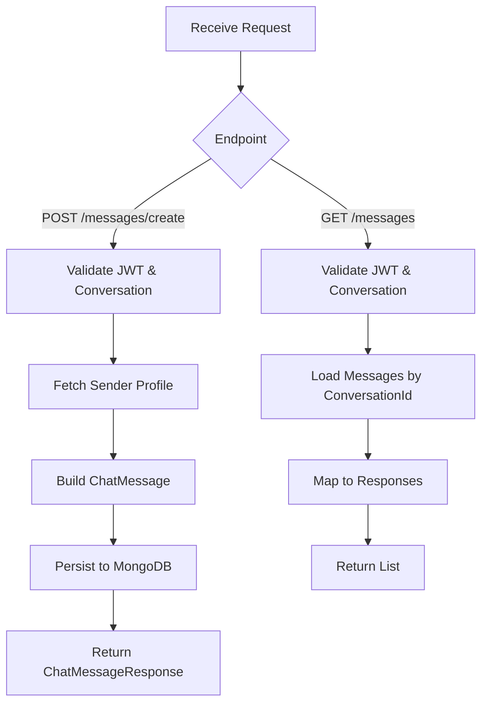

### Chat Service - Activity Diagram

```mermaid
flowchart TD
  A[Receive Request] --> B{Endpoint}
  B -->|POST /messages/create| C[Validate JWT & Conversation]
  B -->|GET /messages| H[Validate JWT & Conversation]

  C --> D[Fetch Sender Profile]
  D --> E[Build ChatMessage]
  E --> F[Persist to MongoDB]
  F --> G[Return ChatMessageResponse]

  H --> I[Load Messages by ConversationId]
  I --> J[Map to Responses]
  J --> K[Return List<ChatMessageResponse>]
```

