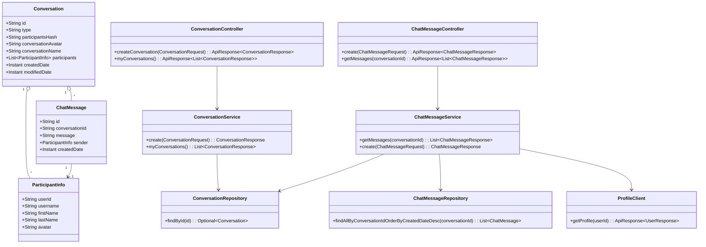

### Chat Service - Class Diagram

```mermaid
classDiagram
  class Conversation {
    +String id
    +String type
    +String participantsHash
    +String conversationAvatar
    +String conversationName
    +List~ParticipantInfo~ participants
    +Instant createdDate
    +Instant modifiedDate
  }

  class ParticipantInfo {
    +String userId
    +String username
    +String firstName
    +String lastName
    +String avatar
  }

  class ChatMessage {
    +String id
    +String conversationId
    +String message
    +ParticipantInfo sender
    +Instant createdDate
  }

  class ConversationController {
    +createConversation(ConversationRequest): ApiResponse~ConversationResponse~
    +myConversations(): ApiResponse~List~ConversationResponse~~
  }

  class ChatMessageController {
    +create(ChatMessageRequest): ApiResponse~ChatMessageResponse~
    +getMessages(conversationId): ApiResponse~List~ChatMessageResponse~~
  }

  class ConversationService {
    +create(ConversationRequest): ConversationResponse
    +myConversations(): List~ConversationResponse~
  }

  class ChatMessageService {
    +getMessages(conversationId): List~ChatMessageResponse~
    +create(ChatMessageRequest): ChatMessageResponse
  }

  class ConversationRepository {
    +findById(id): Optional~Conversation~
  }

  class ChatMessageRepository {
    +findAllByConversationIdOrderByCreatedDateDesc(conversationId): List~ChatMessage~
  }

  class ProfileClient {
    +getProfile(userId): ApiResponse~UserResponse~
  }

  ConversationController --> ConversationService
  ChatMessageController --> ChatMessageService

  ConversationService --> ConversationRepository
  ChatMessageService --> ChatMessageRepository
  ChatMessageService --> ConversationRepository
  ChatMessageService --> ProfileClient

  Conversation "1" o-- "*" ParticipantInfo
  Conversation "1" o-- "*" ChatMessage
  ChatMessage "1" --> "1" ParticipantInfo
```

