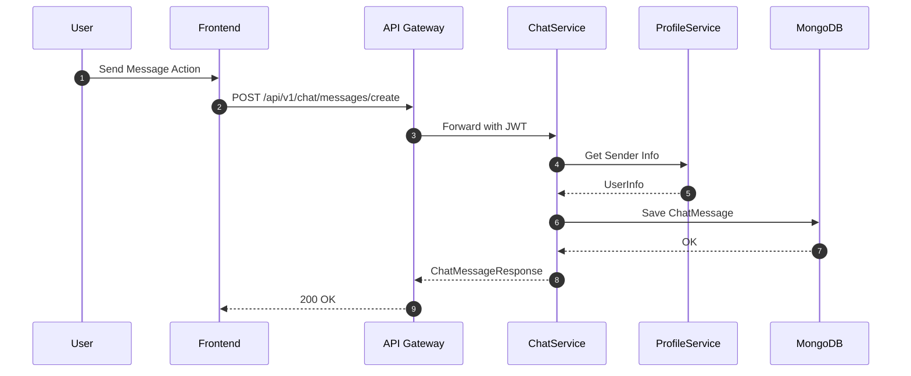

### Chat Service - Communication Diagram

```mermaid
sequenceDiagram
  autonumber
  participant User
  participant Frontend
  participant APIGateway as API Gateway
  participant ChatService
  participant ProfileService
  participant MongoDB

  User->>Frontend: Send Message Action
  Frontend->>APIGateway: POST /api/v1/chat/messages/create
  APIGateway->>ChatService: Forward with JWT
  ChatService->>ProfileService: Get Sender Info
  ProfileService-->>ChatService: UserInfo
  ChatService->>MongoDB: Save ChatMessage
  MongoDB-->>ChatService: OK
  ChatService-->>APIGateway: ChatMessageResponse
  APIGateway-->>Frontend: 200 OK
```

