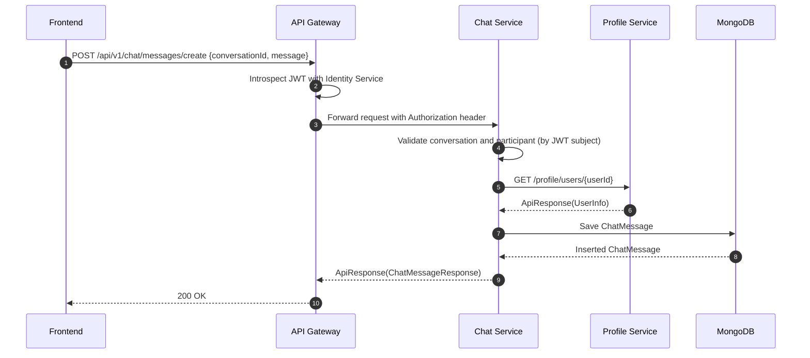

### Chat Service - Sequence Diagram (Send Message)

```mermaid
sequenceDiagram
  autonumber
  participant FE as Frontend
  participant GW as API Gateway
  participant CS as Chat Service
  participant PR as Profile Service
  participant DB as MongoDB

  FE->>GW: POST /api/v1/chat/messages/create {conversationId, message}
  GW->>GW: Introspect JWT with Identity Service
  GW->>CS: Forward request with Authorization header

  CS->>CS: Validate conversation and participant (by JWT subject)
  CS->>PR: GET /profile/users/{userId}
  PR-->>CS: ApiResponse(UserInfo)

  CS->>DB: Save ChatMessage
  DB-->>CS: Inserted ChatMessage

  CS-->>GW: ApiResponse(ChatMessageResponse)
  GW-->>FE: 200 OK
```

